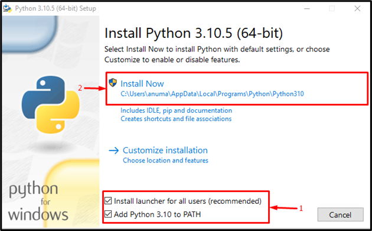

# Download-Install python

https://www.python.org/downloads/

## Windows

- install stable version not (in development)
- path is important


- Check-Version

  ```cmd
  python3 --version
  ```

- open-icon: IDLE or GUI

## Linux

- Ubuntu 16.10 or newer

```cmd
$ sudo apt-get update
$ sudo apt-get install python3.6
```

- another version of Ubuntu

```
$ sudo apt-get install software-properties-common
$ sudo add-apt-repository ppa:deadsnakes/ppa
$ sudo apt-get update
$ sudo apt-get install python3.8
```

- other Linux distribution

```
sudo dnf install python3
```


*****************

------

------------------

# History of Python & Versions



